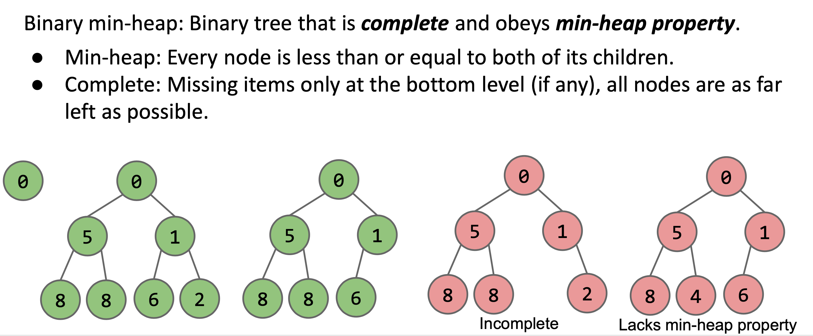
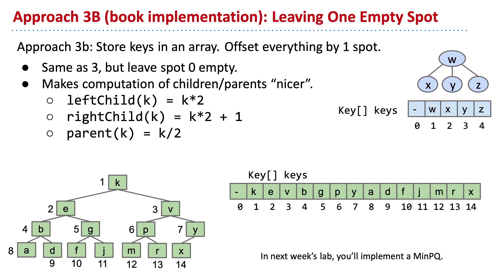

# CS61B 2018 Spring Learning Notes - Chapter 10

## Topics Covered
- Priority Queues
- Heaps

## Priority Queue
### typical interface
```java
/** (Min) Priority Queue: Allowing tracking and removal of the
  * smallest item in a priority queue. */
public interface MinPQ<Item> {
	/** Adds the item to the priority queue. */
	public void add(Item x);
	/** Returns the smallest item in the priority queue. */
	public Item getSmallest();
	/** Removes the smallest item from the priority queue. */
	public Item removeSmallest();
	/** Returns the size of the priority queue. */
	public int size();
}
```
- application
    - keep track of the `smallest`, `largest` or `best`, etc

### example: find the M most unharmonious messsages
```java
public List<String> unharmoniousTexts(Sniffer sniffer, int M) {
    	Comparator<String> cmptr = new HarmoniousnessComparator();
    	MinPQ<String> unharmoniousTexts = new HeapMinPQ<Transaction>(cmptr);
    	for (Timer timer = new Timer(); timer.hours() < 24; ) {
        	unharmoniousTexts.add(sniffer.getNextMessage());
        if (unharmoniousTexts.size() > M) 
           { unharmoniousTexts.removeSmallest(); }
    }
    ArrayList<String> textlist = new ArrayList<String>();
    	while (unharmoniousTexts.size() > 0) {
            textlist.add(unharmoniousTexts.removeSmallest());
    	}
    	return textlist;
}
```
- the above is a better implementation, which only requires `O(M)` memory space
    - this is achieved by always keeping `M` items tracked at the same time at most

### comparison of time complexity with different underlying data structures
|             | Ordered Array | Bushy BST | Hash Table | Heap
|-------------|-----------|-----------|------------|----------|
| add | Θ(N) | Θ(log N) | Θ(1) | Θ(log N) |
| getSmallest | Θ(1) | Θ(log N) | Θ(N) | Θ(1) |
| removeSmallest | Θ(N) | Θ(log N) | Θ(N) | Θ(log N) |

## Heap
### binary min-heap
- definition
    - binary tree that is complete, and obeys min-heap property
- min-heap
    - every node is less than or equal to both of its children
- complete
    - missing items only at the bottom level if any, all nodes are as far left as possible



### array based implementation

- advantages
    - easy to implement (compared with tress)
    - memory efficient (compared with trees)

## Advanced Trees
### traversals
- depth first traversals
    - preorder
    - inorder
    - postorder

```java
public void PreOrder(BSTNode x) {
	if (x != null) {
		print(x.key);
		print(x.left);
		print(x.right);
	}
}
```

```java
public void InOrder(BSTNode x) {
	if (x != null) {
		print(x.left);
		print(x.key);
		print(x.right);
	}
}
```

```java
public void PostOrder(BSTNode x) {
  if (x != null) {
    PostOrder(x.left);
    PostOrder(x.right);
    print(x.key);
  }
}
```

- application
	- post-order traversal for calculating file sizes
