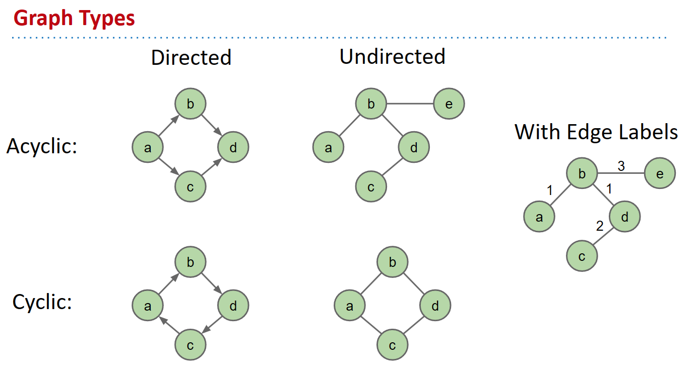
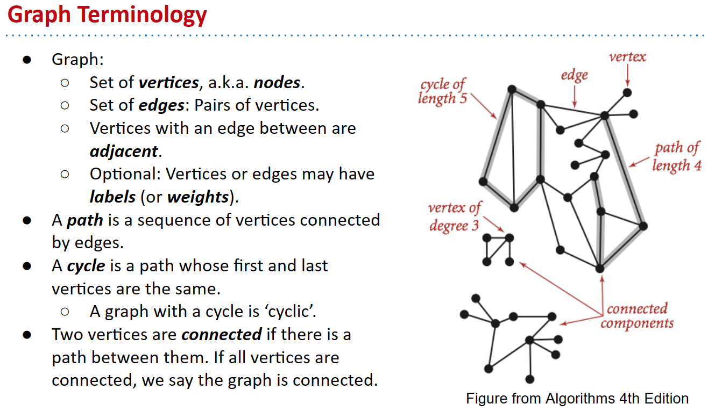
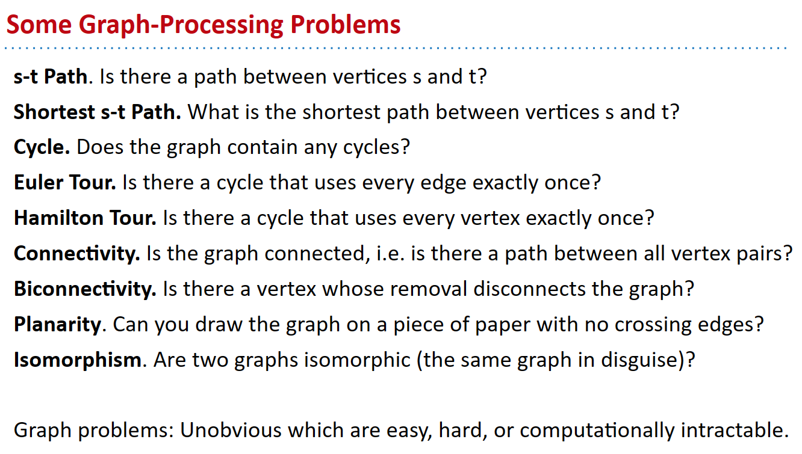

# CS61B 2018 Spring Learning Notes - Chapter 10

## Topic: Graph

### Introudction

> definition of graph

A set of **nodes** (a.k.a vertices) connected pairwise by edges.

> graph types

* directed / undirected
* acyclic / cyclic
  * [ ] why the top-left and bottom-left are both ?
  * [ ] edges starting from the same node are marked with same labels?

> terminologies

* highlights
  * path: connected vertices
  * connectivity: vertices and graph

> typical problems

* summarization
  * connectivity
  * shortest paths
