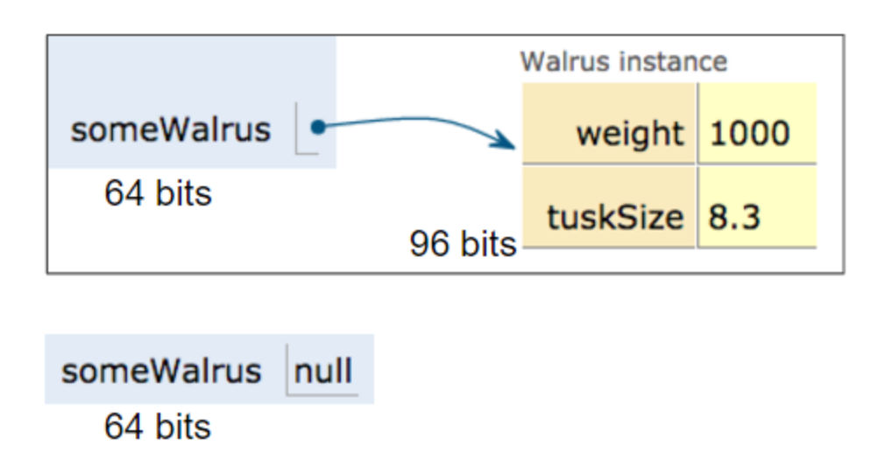

# CS61B 2018 Spring Learning Notes - Chapter 2

## Topic: data structure of List

### Objects
```java
Walrus a = new Walrus(1000, 8.3);
Walrus b;
b = a;
b.weight = 5;

int x = 5;
int y;
y = x;
x = 2;
```
- `b` and `a` points to the same instance, i.e. same memory address
- primitive types: values are directly copied

### Variable and bits representation in memory
`In addition to setting aside memory, the Java interpreter also creates an entry in an internal table that maps each variable name to the location of the first bit in the box.`
- internal lookup table and data structure used to locate the memory efficiently


### Variables can be used until they are initialized

### Primitive types and reference types
- variable stores the address of the instance of any reference type
```java
Walrus someWalrus;
someWalrus = new Walrus(1000, 8.3);
```



### Parameter passing
- always **pass by value** in Java 


### IterativeSize
- `this` can't be re-assigned


### Nested Classes
- `A simple rule of thumb is that if you don't use any instance members of the outer class, make the nested class static.`


### Empty List
- `addLast` method doesn't work on empty lists
- `getFirst` method also doesn't work on empty lists


### Special Cases
- Try to avoid special cases as much as possible by having a good design of code

### Add details here explaining why
- sentinel node is needed: avoid special case of empty list
- last is needed: avoid complexity of finding the second to last node
- another sentinel node is needed: avoid special case of checking last points to sentinel or normal node

However, there are still some special cases need to be considered. For example, in the implementation of DLList with two sentinel nodes, the method `addFirst`, `tail` sentinel node need to point to the new first node when the list was empty.

It actually makes sense because add the first element only makes change to the `head` sentinel node, and the `tail` sentinel node need initial `pointee`, otherwise, it can't start keeping tracking the last node as it always points to either `null` or a constant node. Same as add the last element. (Here the special case of empty list is discussed).


### Generic (similar to template in `C++`)
- `public class DLList<T>`
- `DDList<T> list = new DLList<T>()`
- generics only support reference types, so primitive types have to be used with `Integer`, `Double`, `Character`, etc.
- **PENDING QUESTION**: which value should be used for sentinel as generic type is unknown? It seems that only `null` is usable?